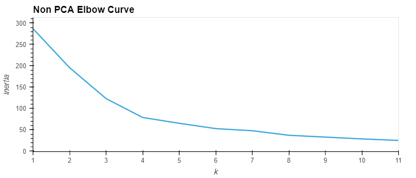

# Crypto Clustering PCA Challenge
## Directory
- `Images` contains image files of the analysis results
- `Resources` contains the data used in the analysis
- `Crypto_Clustering` is the code used to run the analysis
## Overview
In this challenge, you’ll use your knowledge of Python and unsupervised learning to predict if cryptocurrencies are affected by 24-hour or 7-day price changes.

## Analysis

.png)

- The best value for K is 4 for both the non PCA and PCA curves

.png)
.png)

- After reducing the number of features, the clustering improved significantly and reduced the amount of noise in the data.